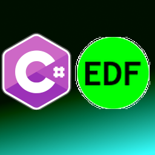

<h1 align="center">EDF-CSharp: C# EDF Implementation </h1> 

 

  

# Summary

SharpLibEuropeanDataFormat allows you to read EDF files typically used in medical applications.
See [EDF specification](http://www.edfplus.info/specs/edf.html).
Support for writing was left in place but is untested and most certainly broken.

This project is provided under the terms of the [MIT license](http://choosealicense.com/licenses/mit/).

# Binary Distribution
The easiest way to make use of this library in your own project is to add a reference to the following [NuGet package](https://www.nuget.org/packages/SharpLibEuropeanDataFormat/).

# European Data Format

## Header

| # Chars | File description                               |
|---------|------------------------------------------------|
|8 ascii  | version of this data format (0) |
|80 ascii | local patient identification |
|80 ascii | local recording identification |
|8 ascii  | startdate of recording (dd.mm.yy)|
|8 ascii  | starttime of recording (hh.mm.ss) |
|8 ascii  | number of bytes in header record |
|44 ascii | reserved |
|8 ascii  | number of data records|
|8 ascii  | duration of a data record, in seconds |
|4 ascii  | number of signals (ns) in data record |
|ns * 16 ascii | ns * label (e.g. EEG Fpz-Cz or Body temp)|
|ns * 80 ascii | ns * transducer type (e.g. AgAgCl electrode) |
|ns * 8 ascii  | ns * physical dimension (e.g. uV or degreeC) |
|ns * 8 ascii  | ns * physical minimum (e.g. -500 or 34) |
|ns * 8 ascii  | ns * physical maximum (e.g. 500 or 40) |
|ns * 8 ascii  | ns * digital minimum (e.g. -2048) |
|ns * 8 ascii  | ns * digital maximum (e.g. 2047) |
|ns * 80 ascii | ns * prefiltering (e.g. HP:0.1Hz LP:75Hz) |
|ns * 8 ascii  | ns * nr of samples in each data record |
|ns * 32 ascii | ns * reserved|

## Data Record

| # Chars                   | File description                |
|---------------------------|---------------------------------|
|nr of samples[1] * integer | first signal in the data record |
|nr of samples[2] * integer | second signal                   |
|.. | |
|.. | |
|nr of samples[ns] * integer | last signal |
